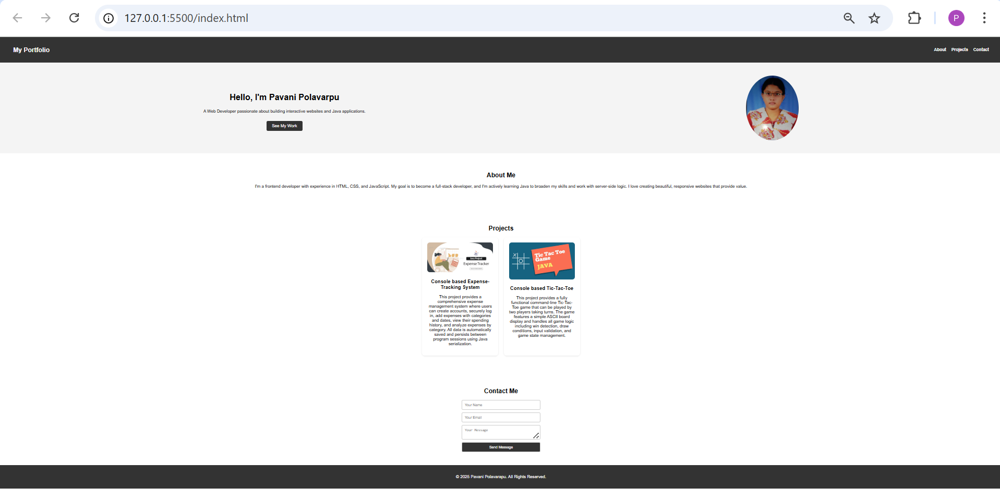

# Personal Portfolio Website

A clean, modern, and fully responsive portfolio website built with vanilla HTML, CSS, and JavaScript. This website showcases my skills, projects, and experience as a web developer.

## About

This is my personal portfolio website created using pure HTML, CSS, and JavaScript. The website is designed to be lightweight, fast-loading, and accessible while maintaining a professional appearance. It showcases my web development skills and serves as a platform to display my projects and experience.

## ✨ Features

- **Fully Responsive**: Optimized for all screen sizes (desktop, tablet, mobile)
- **Modern Design**: Clean and professional layout with smooth CSS animations
- **Interactive Elements**: JavaScript-powered interactive components and effects
- **Project Gallery**: Showcase of my development projects with descriptions and links
- **Contact Form**: Functional contact form with client-side validation
- **Smooth Scrolling**: Smooth navigation between sections
- **Cross-Browser Compatible**: Works seamlessly across all modern browsers
- **Fast Loading**: Optimized images and minified code for quick load times
- **SEO Friendly**: Proper HTML semantics and meta tags

## 🛠️ Technologies Used

- **HTML5**: Semantic markup and modern HTML features
- **CSS3**: Custom styling with Flexbox, Grid, animations, and transitions
- **JavaScript (ES6+)**: Interactive functionality and DOM manipulation
- **CSS Grid & Flexbox**: Modern layout techniques
- **CSS Variables**: Consistent theming and easy customization
- **Media Queries**: Responsive design implementation

### Customization

1. **Personal Information**: 
   - Update your name, title, and bio in `index.html`
   - Replace placeholder text with your own content

2. **Projects**: 
   - Add your projects in the projects section of `index.html`
   - Update project images in the `images/` folder
   - Modify project descriptions and links

3. **Styling**: 
   - Customize colors in `style.css`
   - Modify the CSS variables at the top of the file for consistent theming
   - Adjust layouts, fonts, and animations as desired

4. **Contact Form**: 
   - Update the form action in `index.html` to point to your form handler
   - Modify form validation in `script.js`

5. **Images**: 
   - Replace profile photo and project images in the `images/` folder
   - Optimize images for web (use tools like TinyPNG)

## 📄 File Descriptions

- **index.html**: The main page containing all sections (header, about, skills, projects, contact)
- **css/style.css**: All styling including layout, colors, animations, and responsive design
- **js/script.js**: Interactive functionality, smooth scrolling, form validation, and animations
- **images/**: All visual assets including profile photo, project screenshots, and icons
- **assets/**: Downloadable files like your resume

### Hero Section
- Eye-catching introduction with animated elements
- Call-to-action buttons for resume and contact

### About Me
- Professional summary and background
- Personal interests and values

### Projects
- Featured projects with live demos and source code links
- Project descriptions, technologies used, and key features

### Contact
- Multiple ways to get in touch
- Functional contact form with validation

## 🚀 Deployment

### GitHub Pages (Free)
1. Push your code to a GitHub repository
2. Go to repository Settings → Pages
3. Select source branch (usually `main` or `master`)
4. Your site will be available at `https://yourusername.github.io/repository-name`

